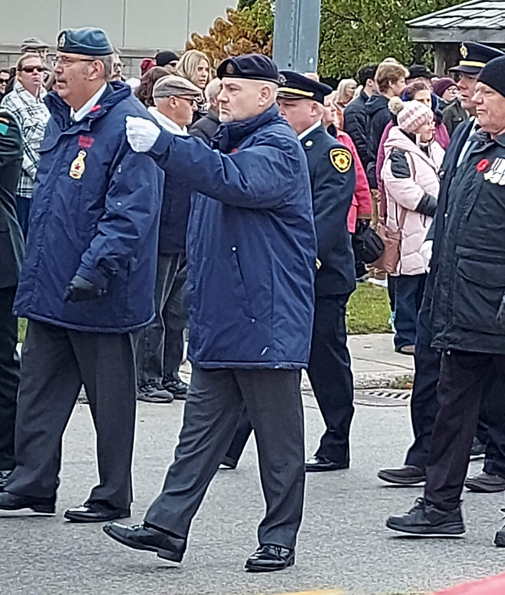

Bro. Michael Enns proudly representing Bernard Lodge by marching in the Rememberance Day Parade.

Bro. Michael Enns is a Veteran of HM Armed Forces (Army). He served in the Royal Logistic Corps, 7 Transport Regiment, 16 Tank Transporter Squadron as a Driver Specialist.  During which time he served in the UK, Germany and on operational tour of the Former Republic of Yugoslavia (Bosnia) with NATO