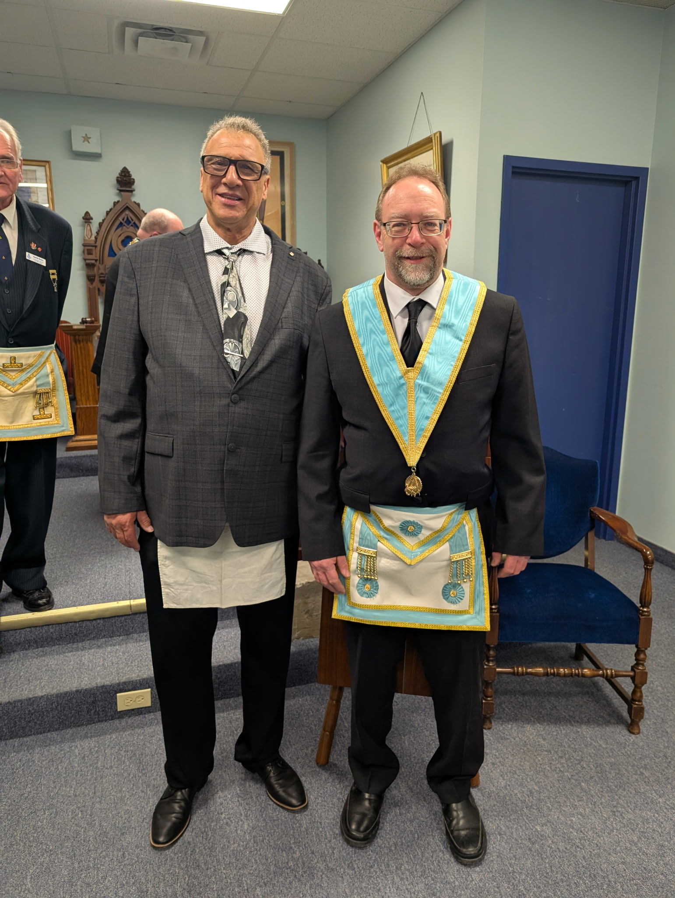
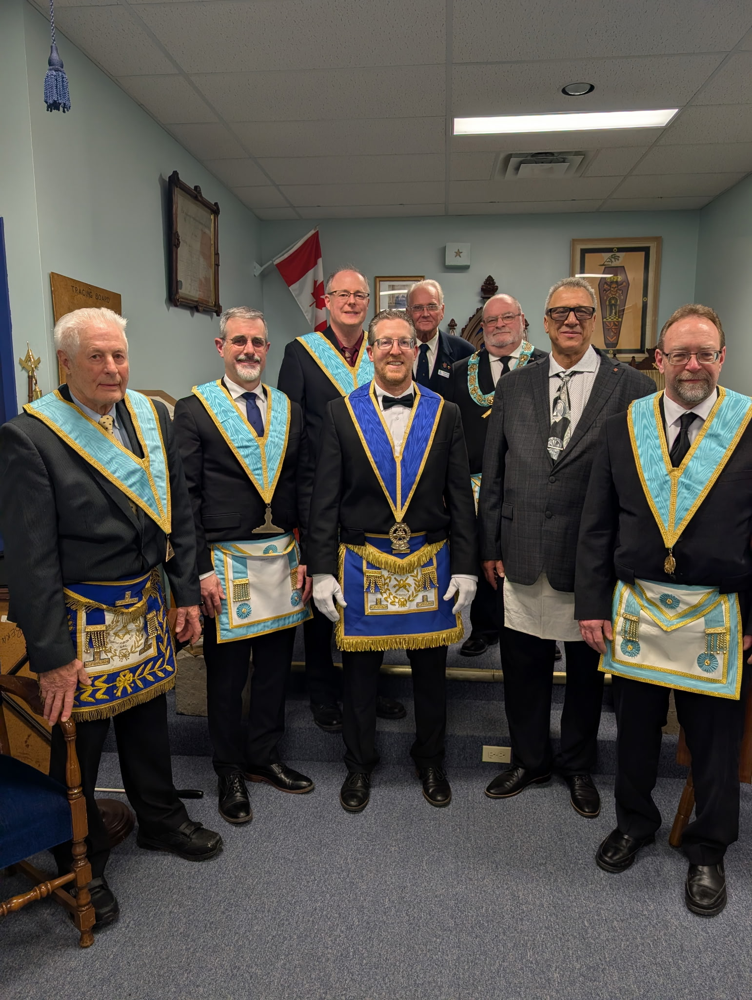

*(Brethren pictured in the photo - can be updated upon review)*

On April 21st, Bernard Lodge had the distinct pleasure of initiating Gino Cortese into the mysteries of Ancient Freemasonry. 

Brother Cortese took his very first step in Ancient Craft Masonry by being initiated as an Entered Apprentice. The officers and members performed an excellent ceremony, marking the beginning of what we hope will be a rewarding and enlightening Masonic journey.

We are thrilled to welcome Brother Gino Cortese to our ranks and to the greatest fraternity in the world!

*(Brethren pictured in the second photo - can be updated upon review)*

**Welcome, Brother Cortese!**
