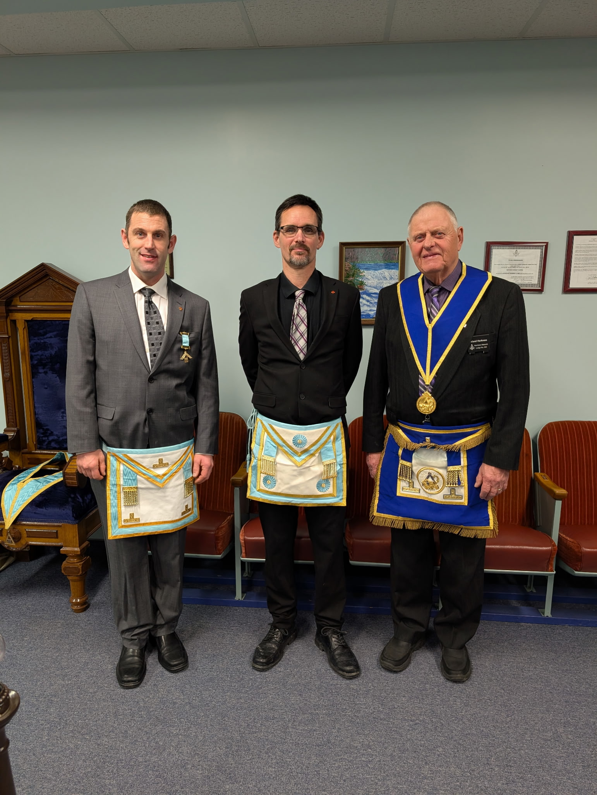
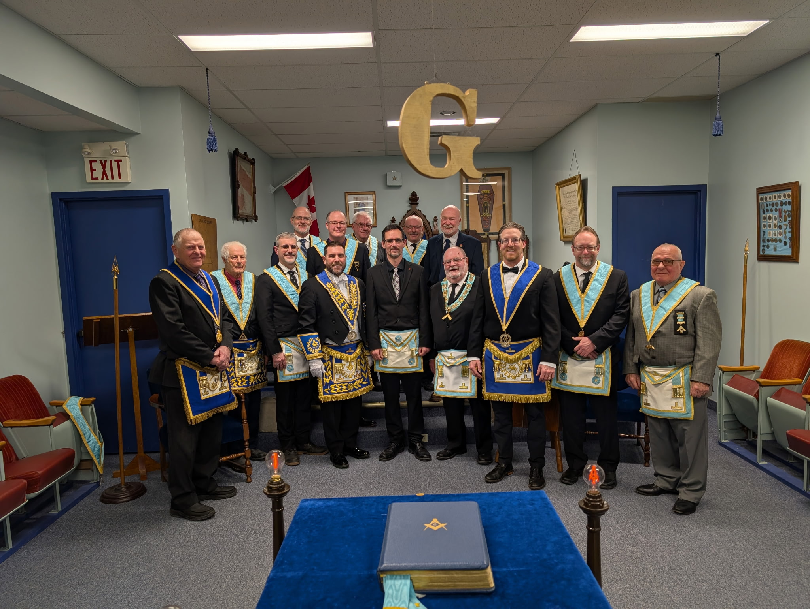

On February 2nd, Bernard Lodge had the privilege and pleasure of holding a 3rd Degree Ceremony to Raise Brother Kevin Haskins to the Sublime Degree of a Master Mason.

Brother Haskins proved his proficiency in the preceding degrees and took his final steps in ancient craft Masonry. He was admitted to the secrets and mysteries of this high and sublime degree, and received further Light in Masonry. 

We warmly welcome Brother Kevin Haskins to the ranks of Master Masons and wish him a long, fruitful, and illuminating Masonic journey.

**Congratulations Brother Haskins, Master Mason!**
