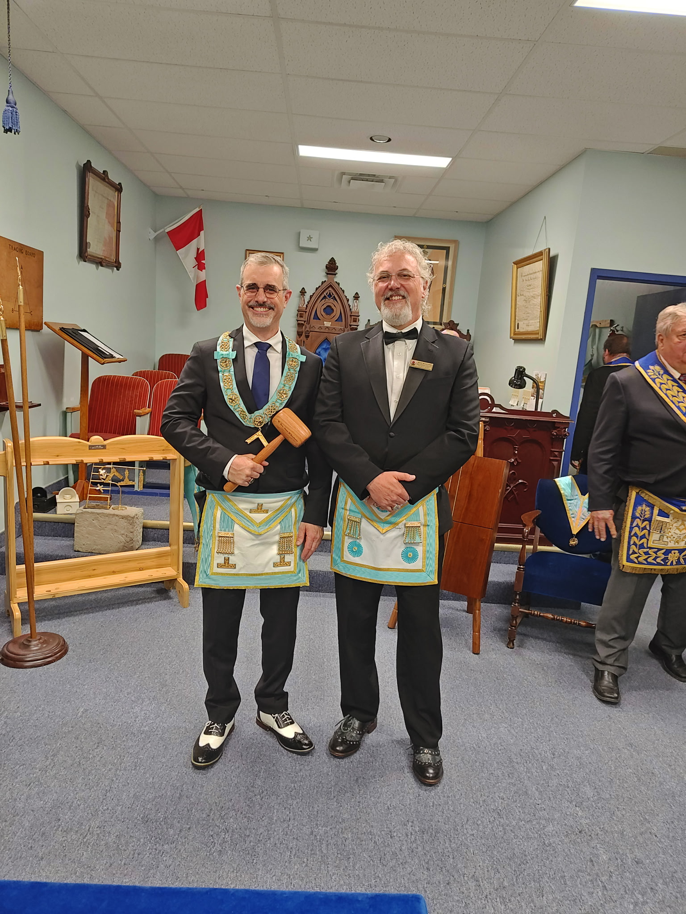
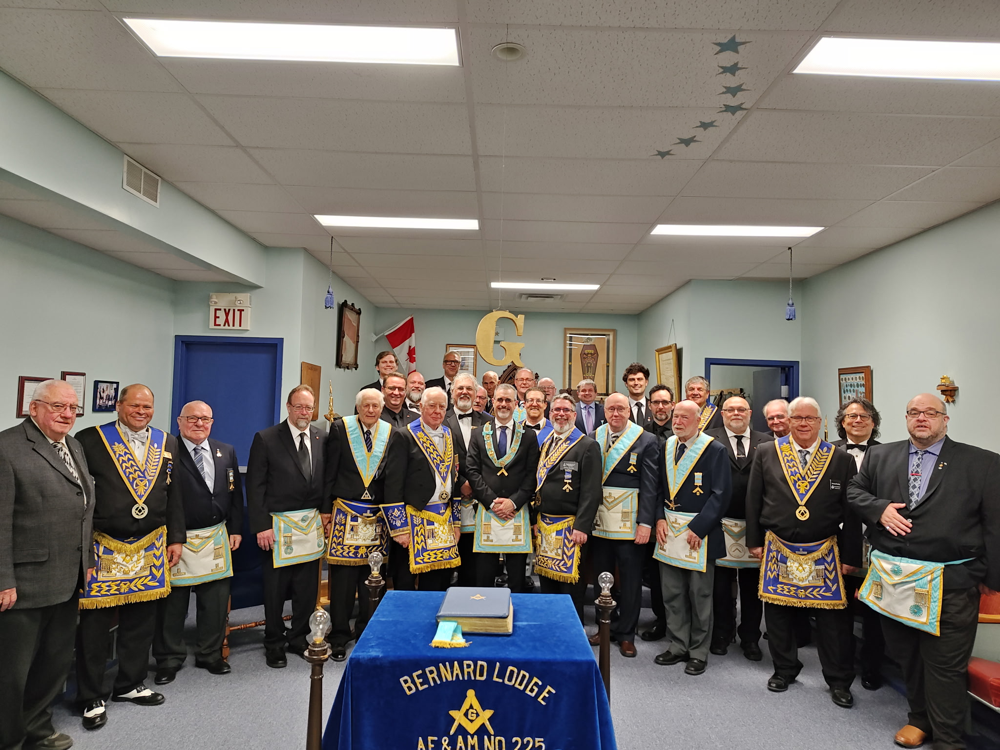

On May 19th, Bernard Lodge celebrated the Installation and Investiture of Worshipful Brother Sean McKechnie as Worshipful Master, along with his officers for the ensuing Masonic year.

R.W. Bro. John Main served as the Installing Master, conducting a beautiful and solemn ceremony to place W. Bro. McKechnie into the Chair of King Solomon. 

We extend our sincere and fraternal thanks to the visiting brethren from New Dominion Lodge and Harriston Lodge. Your attendance, assistance, and warm fellowship added greatly to the success and joy of this auspicious evening.

We wish Worshipful Brother McKechnie and his newly invested officers a successful, harmonious, and productive year in the East!

**Congratulations Worshipful Brother Sean McKechnie!**
