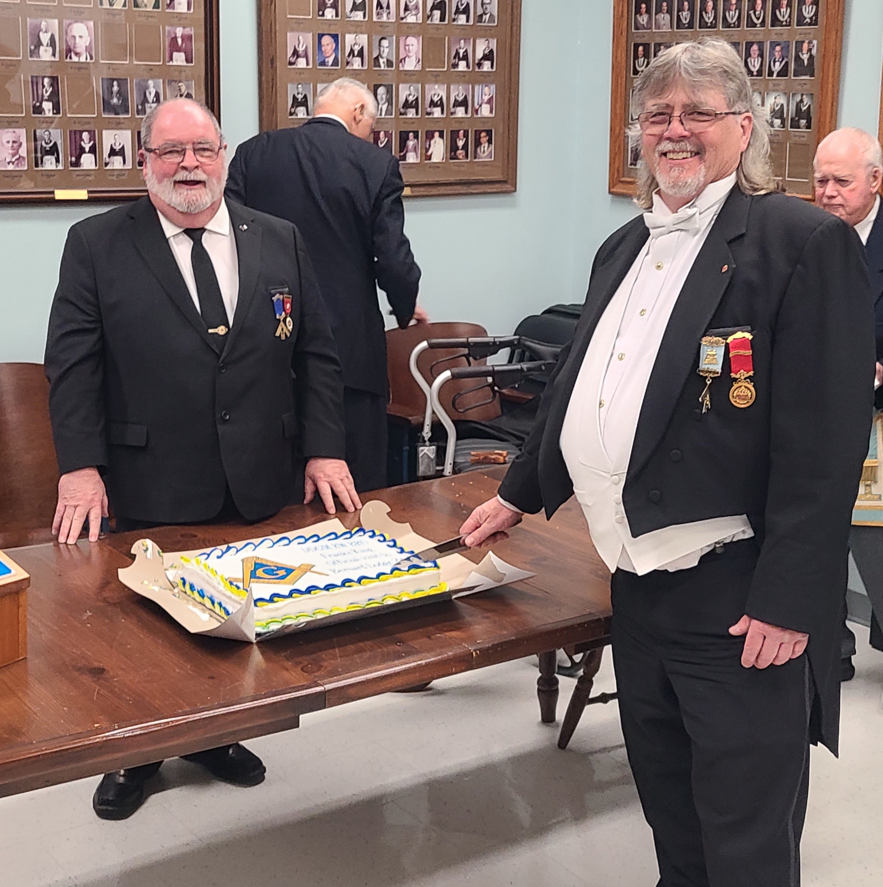

*From Left to Right.  W.B. David Ross, Morning Star-Clinton,No. 309, W.B. Joe Wragg, Lebannon-Forest, No.133, R.W.Bro. Frank King, DDGM Huron District,  W.B.Jeff French Tudor, No.141
 W.B. Allan Toner Bernard, No. 225, W.B. Cliff Anderson St. James -Tecumseh, No.73, W.B. David Dryburgh Craig No.574*

R.W.Bro. Frank King visited Bernard Lodge on his Official Visit to Bernard Lodge.
